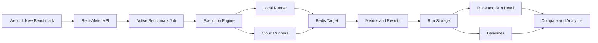
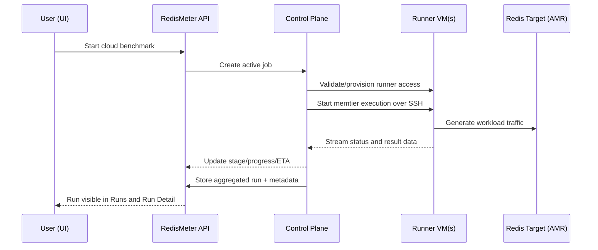

# RedisMeter Beginner UI Workflow

This is the practical onboarding guide for RedisMeter.

Use it to understand both:

1. The user flow in the web UI
2. The runtime model under the hood (jobs, runners, cloud execution, aggregation)

## At a Glance

By the end of this guide you will know:

1. What Benchmark, Baseline, Compare, and Analysis mean in RedisMeter
2. How benchmark job handling works in local and cloud runs
3. What a runner is and how multi-runner cloud execution works
4. How to execute and validate a full benchmark-to-baseline workflow in the UI
5. What to check in run metadata for reproducibility and trustworthy comparisons

---

## Quick Concept Primer

| Term | Meaning | Why It Matters |
|------|---------|----------------|
| Benchmark run | One executed performance test against a Redis target | Produces throughput, latency, error, and environment data |
| Baseline | A chosen run used as the reference point | Enables regression detection and controlled comparisons |
| Job | Runtime lifecycle object for an active benchmark | Powers stage/progress/ETA in the UI |
| Runner | Machine that executes memtier_benchmark | Defines where load is generated |
| Cloud run | Benchmark executed on remote runner VMs | Allows realistic distributed load and high-scale tests |

---

## System Flow (UI to Execution)

---

## Prerequisites

| Requirement | Local Workflow | Azure Cloud Workflow |
|------------|----------------|----------------------|
| RedisMeter backend running | Yes | Yes |
| RedisMeter web UI running | Yes | Yes |
| Reachable Redis target | Yes | Yes |
| Cloud credentials configured | No | Yes |
| Cloud infrastructure profile or permissions | No | Yes |

---

## UI Page Map (Learn in This Order)

1. Dashboard: Validate system health and recent activity.
2. New Benchmark: Create benchmark jobs and observe progress.
3. Runs: Browse completed runs.
4. Run Detail: Inspect performance and environment metadata.
5. Baselines: Mark trusted reference runs.
6. Compare: Evaluate deltas and regressions.
7. Analytics: Inspect trends across historical runs.

---

## Workflow A: First Local Benchmark

This is the recommended first run for new users.

### Step 1: Create a benchmark job

In New Benchmark:

1. Select workload (for example cache, mixed, read-heavy).
2. Configure runtime inputs:
- duration or requests
- clients
- threads
3. Set target host and port.
4. Start benchmark.

What this triggers:

1. A job object is created in the backend.
2. memtier execution starts.
3. Progress and stage updates are published to the UI.

### Step 2: Observe job handling in real time

Watch these fields in New Benchmark:

1. Status
2. Stage label
3. Elapsed time
4. Estimated remaining time (ETA, if available)

Interpretation:

1. Smooth stage transitions indicate healthy orchestration.
2. Long stalls in a stage can indicate target pressure, connectivity, or runner issues.

### Step 3: Validate run output in Run Detail

After completion:

1. Open Runs.
2. Open the most recent run.
3. Validate metrics and metadata.

Check this minimum set:

1. Throughput (ops/sec)
2. Latency percentiles (P50, P95, P99)
3. Error counts
4. Environment context (host, target, config metadata)

### Step 4: Create a baseline

In Baselines:

1. Create baseline from the run.
2. Use a meaningful name with purpose and scope.

Naming examples:

1. local-cache-baseline-v1
2. azure-amr-balanced-b5-cache-v1

### Step 5: Execute controlled comparison

Run a second benchmark with one intentional change only.

Good comparison changes:

1. Increase clients only
2. Increase threads only
3. Switch workload mix only

Then compare against baseline in Compare page.

---

## Metric Interpretation Cheat Sheet

| Metric | Good Sign | Warning Sign |
|-------|-----------|--------------|
| Throughput | Stable or improved ops/sec at same workload | Throughput drops while latency rises |
| P50 latency | Similar between runs | Large jump without config change |
| P95/P99 latency | Controlled increase with higher load | Sharp tail-latency spike |
| Errors | Near zero in stable tests | Timeouts/connection errors appear |

Decision rule for beginners:

1. If throughput improved but P99 regressed heavily, investigate before accepting.
2. If throughput and P99 both improve, change is likely beneficial.
3. If both degrade, treat as regression.

---

## Workflow B: Azure Cloud Benchmark (Runner-Focused)

Use cloud mode for realistic distributed load generation.

### What a runner means in practice

A runner is a VM dedicated to load generation.

Runner responsibilities:

1. Execute memtier_benchmark
2. Send benchmark traffic to the Redis target
3. Return results and runtime signals back to RedisMeter

RedisMeter process on your machine remains the control plane.

### Azure cloud execution sequence

### What to verify after cloud completion

In Run Detail, check environment sections for reproducibility:

1. Host details: runner hostname, OS, CPU shape
2. Cloud details: provider, region, instance type
3. Redis config metadata:
- AMR SKU
- clustering mode
- high availability setting
- auth mode flags (access keys, Entra state)
- TLS minimum and endpoint metadata

If these fields are present, future comparisons become much more reliable.

---

## Job Lifecycle Deep Dive

Typical lifecycle model:

| Stage | Local Run | Cloud Run |
|------|-----------|-----------|
| Created | Job object created | Job object created |
| Preparing | Validate local target + workload | Validate infra/runner access + target |
| Running | memtier on local runner | memtier on one or more remote runners |
| Collecting | Parse and store local results | Aggregate runner results and store |
| Completed/Failed | Final status emitted | Final status emitted |

UI behavior:

1. Polling or streaming updates refresh stage and progress.
2. ETA is an estimate, not a hard SLA.
3. Stage labels are more informative than raw percent alone.

---

## Reproducibility Checklist

Before trusting a comparison, confirm:

1. Same workload profile
2. Same clients/threads and duration or request count
3. Same target topology and auth/TLS mode
4. Same or intentionally changed runner shape
5. Complete run metadata present in Run Detail

---

## Common Beginner Mistakes

1. Comparing runs with multiple variable changes at once
2. Using unclear baseline names
3. Ignoring environment differences in run metadata
4. Treating ETA as exact completion time
5. Running cloud tests without runner-to-target network validation

---

## Troubleshooting Quick Table

| Symptom | Likely Cause | First Check |
|--------|--------------|-------------|
| Job appears stuck in preparing | Target or runner connectivity issue | Run status stage label and backend logs |
| Throughput unexpectedly low | Target saturation or insufficient runner capacity | Compare runner shape and target config |
| Tail latency spike | Overload or contention | P95/P99 trend and error counts |
| Empty environment section | Legacy run or incomplete metadata capture | Verify run creation time and rerun benchmark |

---

## Suggested First Three Experiments

1. Stability experiment: identical run twice, verify low drift.
2. Concurrency experiment: increase clients only, compare baseline.
3. Topology experiment: local runner vs Azure cloud runners.

---

## Where to Go Next

1. [Documentation Hub](./Documentation_Index.md)
2. [Architecture](./Architecture.md)
3. [Azure Deployment Design](./Azure_Deployment_Design.md)
4. [Azure Managed Redis Design](./Azure_Managed_Redis_Design.md)
5. [Azure Provider Design](./Azure_Provider_Design.md)
